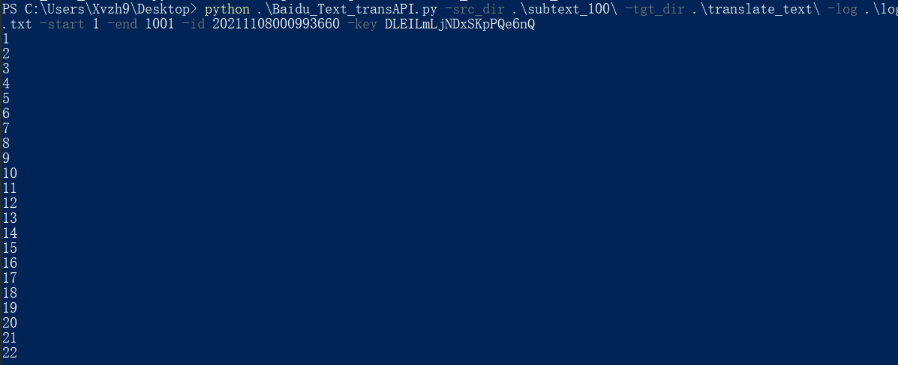
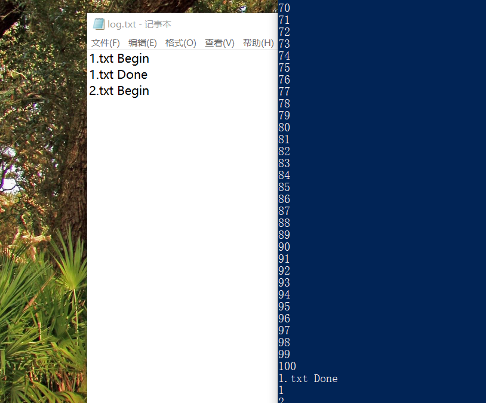
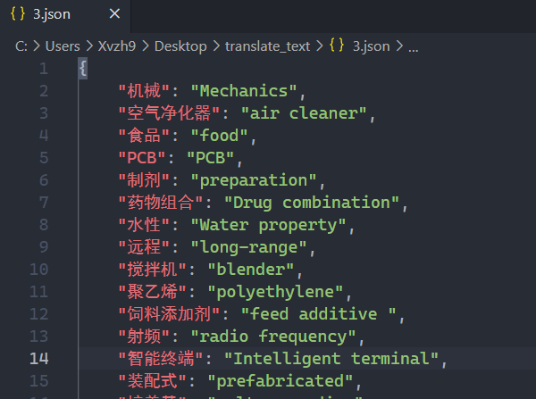

# README

Baidu_Test_transAPI.py

```python
parse.add_argument("-src_dir", "--src_dir_path", help="src dir path", default="E:\\Git\\hw\\NLP\\subtext_100")
    parse.add_argument("-tgt_dir", "--tgt_dir_path", help="tgt dir path", default=r"E:\Git\hw\NLP\translate_text")
    parse.add_argument("-log", "--log_path", help="log path", default=r"E:\Git\hw\NLP\log.txt")
    parse.add_argument("-start", "--start_file", type=int, help="start file number, number part of file name", default=1)
    parse.add_argument("-end", "--end_file", type=int, help="end file number, number part of file name", default=1001)
    parse.add_argument("-id", "--appid", help="api id", default="0")
    parse.add_argument("-key", "--appkey", help="api key", default="0")
```

参数解释如下


| src_dir    | 为subtext_100的位置                                          |
| ---------- | ------------------------------------------------------------ |
| tgt_dir    | 为存放翻译后json的文件夹的位置                               |
| log        | 为log.txt的位置，若暂无该文件，可新建一个txt文件作log（log非常重要） |
| start_file | 起始文件的数字部分，类型为int                                |
| end_file   | 结束文件的数字部分，类型为int                                |
| appid      | 百度通用翻译api提供                                          |
| appkey     | 百度通用翻译api提供                                          |

 本文件适用于百度通用翻译高级版，每秒6次的访问量


## 示例

```sh
 python .\Baidu_Text_transAPI.py -src_dir .\subtext_100\ -tgt_dir .\translate_text\ -log .\log.txt -start 0 -end 9097 -id 20210916000946408 -key F1m9uev7TjiMWDreh8wq
```

### 开始




### Done即表明该文件完成



### 若出现下列情况即为连接超时，脚本通过log文件读取未完成的语料文件，重新开始


### 部分结果



